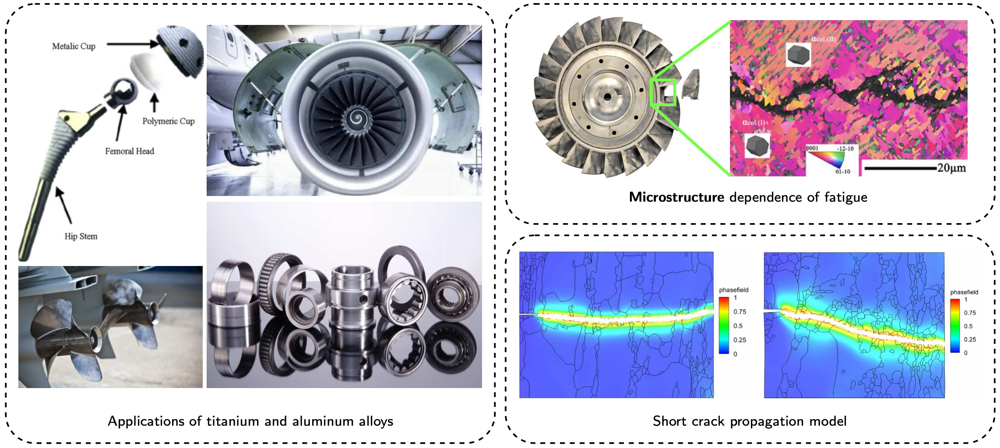

<h1> Key Research Projects </h1>

<section class="research-section">
  <h2>Postdoctoral Research</h2>

  
  
<em>Figure courtesy: Ghosh (2024), Nikitin et al. (2023), Wang et al. (2021), Chunxian et al. (2011), bjhighstar.com, refractorymetal.com, titanium.com</em>

  

    <h3>Multiscale Modeling of Titanium Alloys</h3>
    
Description of the work, methods, and outcomes...

  

  

    <h3>Fatigue Behavior in Aerospace Materials</h3>
    
Details about fatigue modeling, validations, etc...

  

</section>

<section class="research-section">
  <h2>Doctoral Thesis</h2>
  

    <h3>Computational Fracture Mechanics</h3>
    
Summary of thesis focus and contributions...

  

</section>

<section class="research-section">
  <h2>Collaboration Projects</h2>
  

    <h3>Bioinspired Shape Memory Polymers</h3>
    
Joint work on SMPs, additive manufacturing, etc...

  

</section>